# AI Conversation Log

These are screenshots of the AI conversations I used while building Tech
Challenge 2. They're grouped by problem, roughly in the order each came up.
Each entry covers what I asked, what the AI flagged, and what I actually did
with it.

## Contents

| # | Screenshots | Topic |
| --- | --- | --- |
| 1 | 01–02 | Pre-apply review of HPA and node group config |
| 2 | 03–04 | Review of the cluster add-ons in `04-addons.tf` |
| 3 | 05 | Pushing back on the number of suggested changes |
| 4 | 08–09 | Recovering from a failed state save |
| 5 | 10–12 | Jenkins failing to start on Java 17 |
| 6 | 13–14 | kubectl hitting Jenkins instead of EKS |
| 7 | 15 | Jenkins timing out on the EKS private endpoint |
| 8 | 16–18 | Restoring the Jenkinsfile after a bad edit |
| 9 | 19–21 | Argo CD failing to authenticate to GitHub |

## 1 — Pre-apply review of HPA and node group config

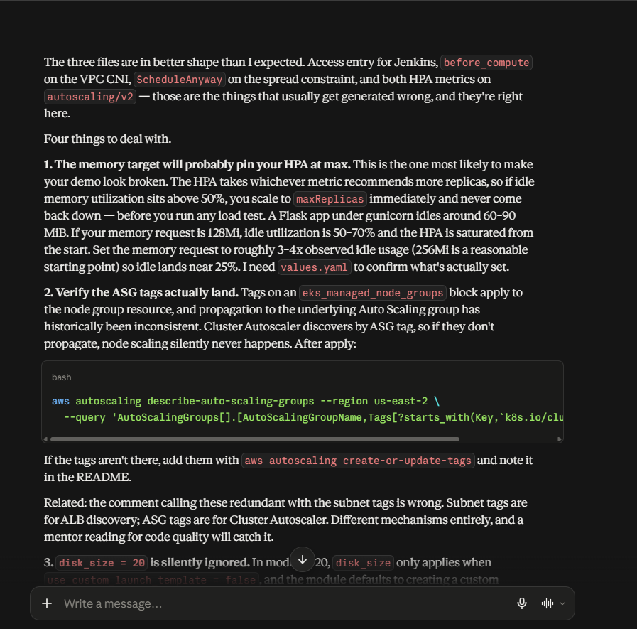

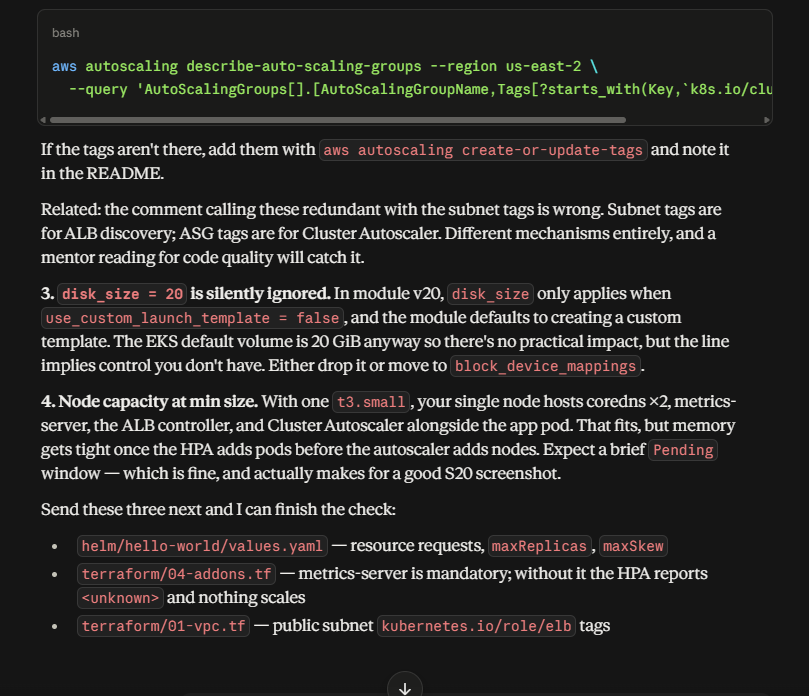

- **Asked:** For a review of my EKS, HPA, and deployment config before
  applying.
- **AI flagged:** A `128Mi` memory request would put idle utilization above
  the HPA's 50% target and pin it at `maxReplicas` before any load test, so
  it suggested `256Mi`. It also said node group tags may not reach the Auto
  Scaling group that Cluster Autoscaler discovers, gave a CLI check for
  that, and noted that `disk_size = 20` is ignored when the module uses a
  custom launch template.
- **What I did:** TODO

## 2 — Review of the cluster add-ons

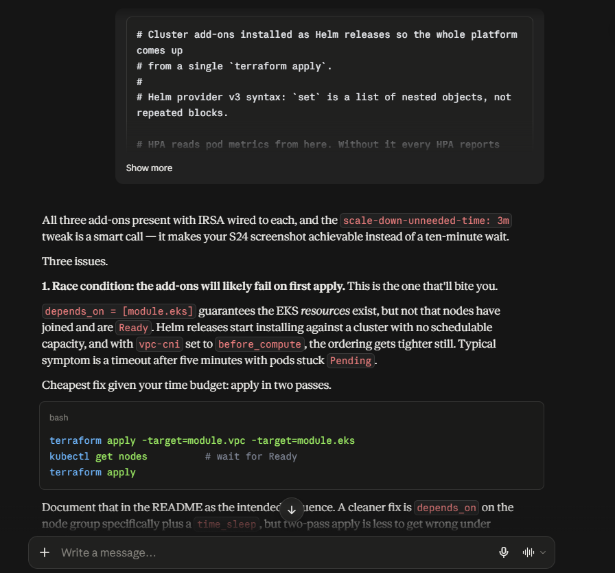

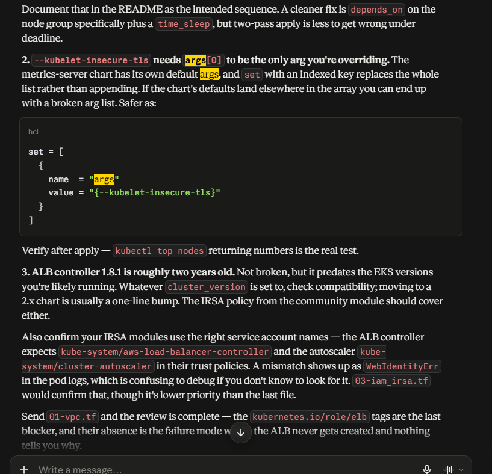

- **Asked:** For a review of `04-addons.tf` (metrics-server, AWS Load
  Balancer Controller, and Cluster Autoscaler as Helm releases).
- **AI flagged:** The Helm releases could start before any nodes were
  `Ready` and time out, so it recommended a two-pass apply that targets the
  VPC and EKS modules first. It said setting `args[0]` on metrics-server
  replaces the chart's whole arg list, and suggested setting `args` to
  `{--kubelet-insecure-tls}` instead. It also raised the ALB controller
  chart's age and said to check the service account names in the IRSA trust
  policies.
- **What I did:** TODO

## 3 — Pushing back on the changes

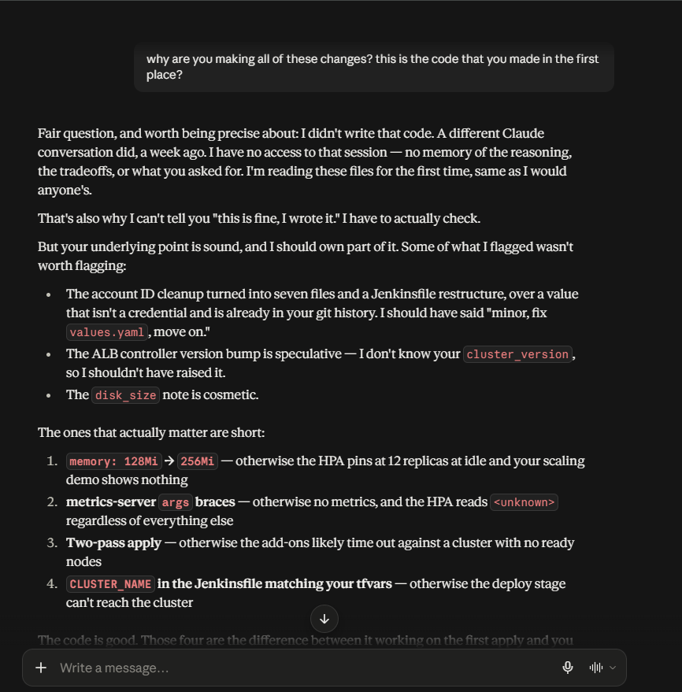

- **Asked:** Why it was making so many changes to code an AI had written in
  the first place.
- **AI response:** Explained that a different conversation wrote the
  original code and it had no access to that session. It conceded that the
  account ID cleanup, the ALB version bump, and the `disk_size` note weren't
  worth raising, and narrowed the list to four fixes: memory request to
  `256Mi`, the metrics-server `args` format, the two-pass apply, and making
  `CLUSTER_NAME` in the Jenkinsfile match the tfvars.
- **What I did:** TODO

## 4 — Recovering from a failed state save

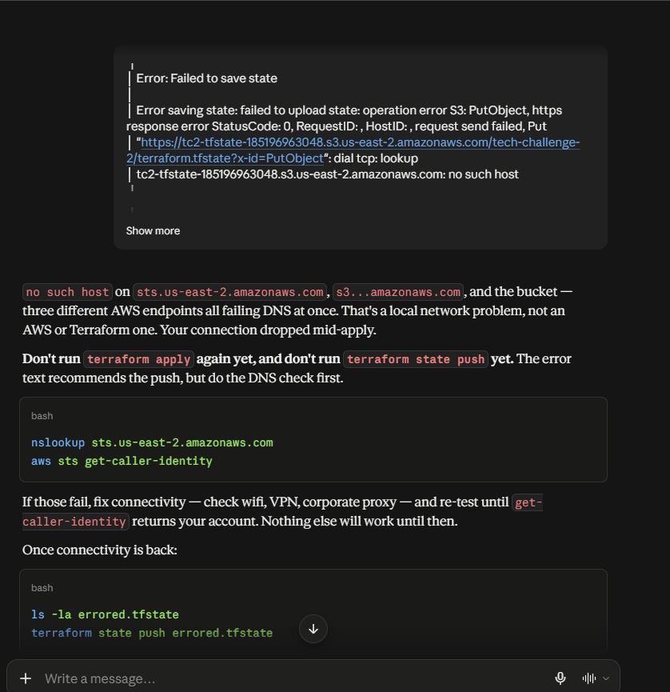

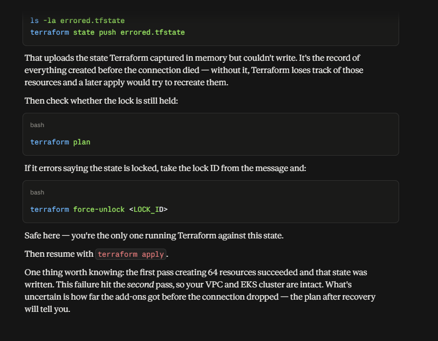

- **Asked:** What to do after the second-pass `terraform apply` failed with
  `Error: Failed to save state` and `no such host` on the S3 endpoint.
- **AI flagged:** Several AWS endpoints were failing DNS at once, so the
  problem was my local connection, not AWS or Terraform. It said not to
  re-run the apply or push state until `nslookup` and
  `aws sts get-caller-identity` worked again. After that: run
  `terraform state push errored.tfstate`, run `terraform plan` to check for
  a held lock (`force-unlock` if so), then resume the apply. The first pass's
  64 resources were already saved, so only the add-ons were uncertain.
- **What I did:** TODO

## 5 — Jenkins failing to start on Java 17

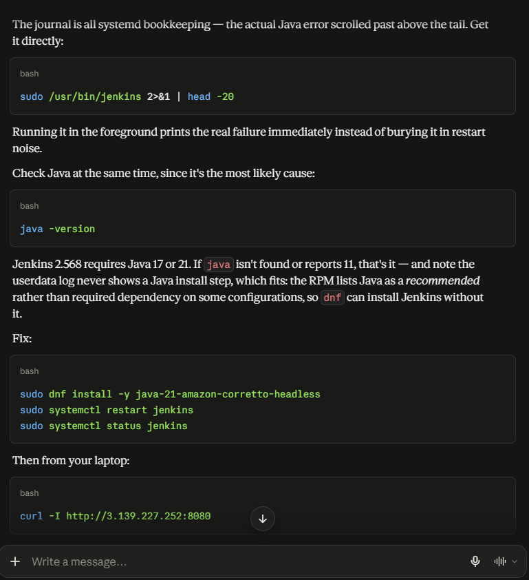

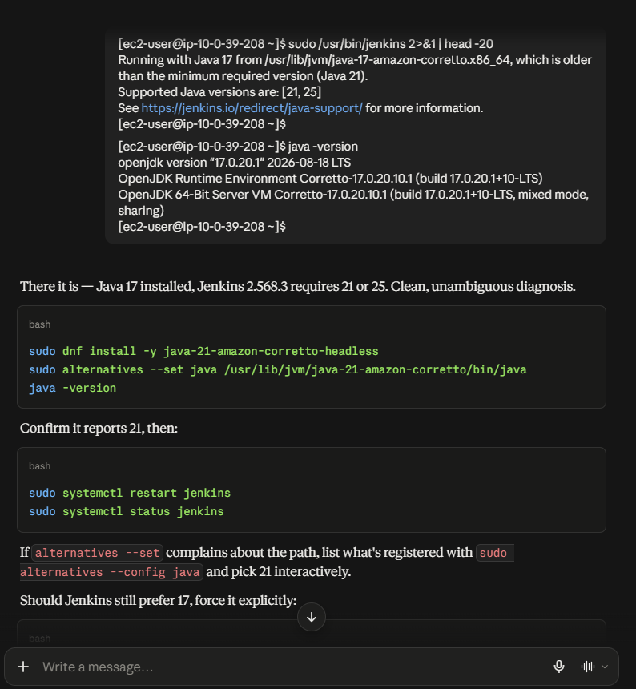

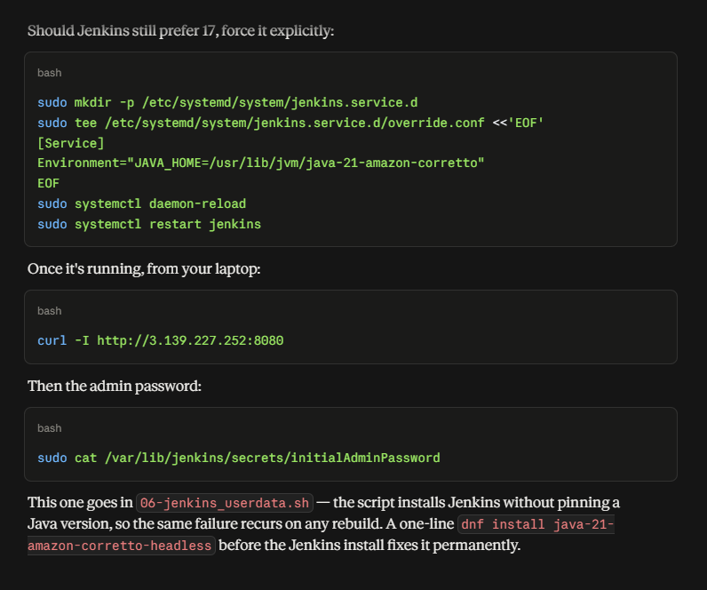

- **Asked:** Why the Jenkins service kept restarting after the EC2 userdata
  script ran.
- **AI flagged:** The journal only showed systemd restarts, so it had me run
  `/usr/bin/jenkins` in the foreground. That showed Java 17 installed while
  Jenkins 2.568.3 requires Java 21 or 25. The fix was to install
  `java-21-amazon-corretto-headless`, switch to it with `alternatives`, and
  force `JAVA_HOME` with a systemd override if needed. It also said to add
  the Java 21 install to `06-jenkins_userdata.sh` so a rebuild wouldn't fail
  the same way.
- **What I did:** Installed Java 21, and Jenkins started (see entry 6).
  TODO: whether the userdata change was committed.

## 6 — kubectl hitting Jenkins instead of EKS

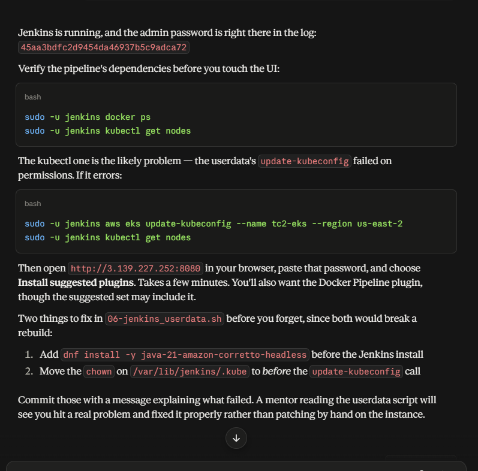

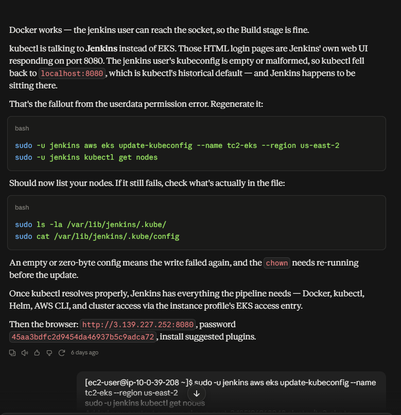

- **Asked:** Why `sudo -u jenkins kubectl get nodes` returned HTML login
  pages instead of node names.
- **AI flagged:** The `jenkins` user's kubeconfig was empty because
  `update-kubeconfig` in the userdata failed on permissions. With no config,
  kubectl defaulted to `localhost:8080`, where Jenkins itself was listening.
  The fix was to re-run `aws eks update-kubeconfig` as the `jenkins` user,
  and to move the `chown` on `/var/lib/jenkins/.kube` before the
  `update-kubeconfig` call in the userdata script.
- **What I did:** Regenerated the kubeconfig, and kubectl reached the real
  EKS endpoint (see entry 7). TODO: whether the userdata change was
  committed.

## 7 — Jenkins timing out on the EKS private endpoint

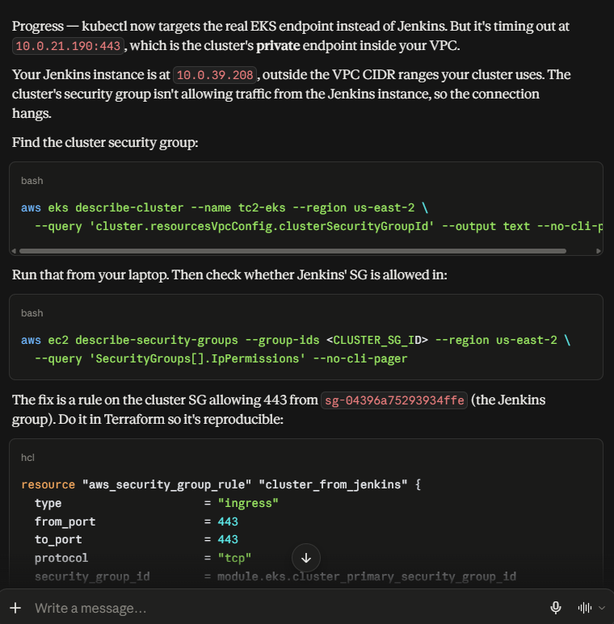

- **Asked:** Why kubectl on the Jenkins instance now timed out instead of
  returning nodes.
- **AI flagged:** kubectl was reaching the cluster's private endpoint on
  port 443, but the cluster security group wasn't allowing traffic from the
  Jenkins security group. It gave CLI commands to find the cluster security
  group and inspect its rules, and suggested an `aws_security_group_rule`
  in Terraform allowing 443 from the Jenkins security group so the fix is
  reproducible.
- **What I did:** TODO

## 8 — Restoring the Jenkinsfile after a bad edit

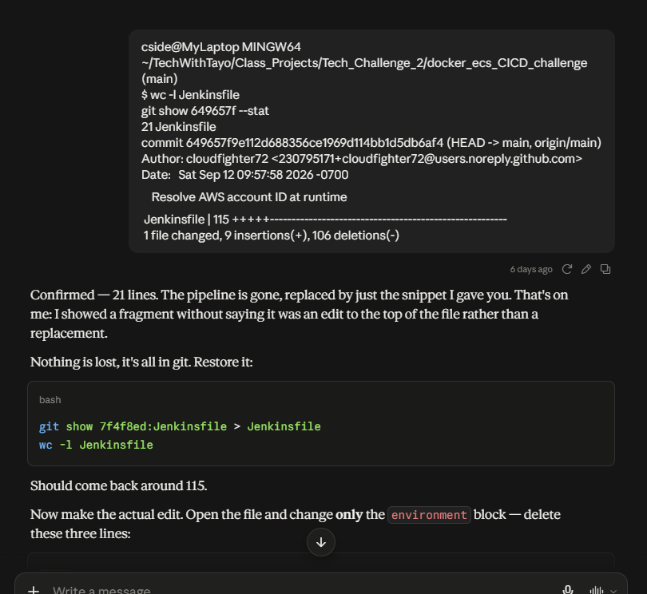

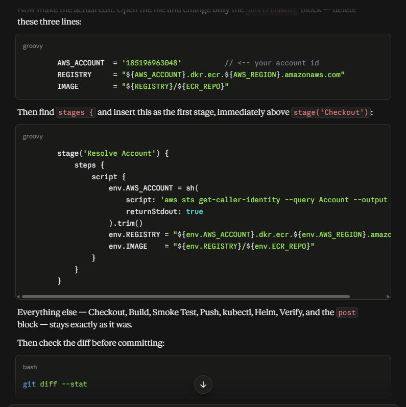

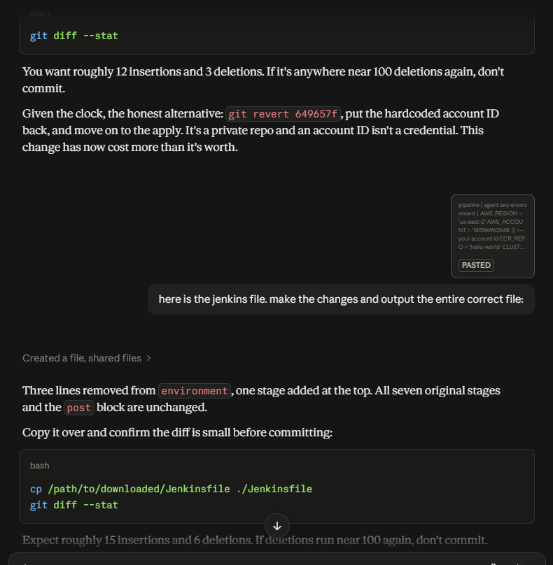

- **Asked:** To stop hardcoding the AWS account ID in the Jenkinsfile.
- **What went wrong:** The AI gave a fragment without saying it was an edit
  to the top of the file, and I used it as a replacement. Commit `649657f`
  cut the Jenkinsfile from about 115 lines to 21. The AI acknowledged the
  mistake and gave a restore with `git show 7f4f8ed:Jenkinsfile`, then the
  real change: remove three lines from `environment` and add a
  `Resolve Account` stage that reads the account from
  `aws sts get-caller-identity`. It said to check `git diff --stat` before
  committing, and offered reverting to the hardcoded value as the faster
  option.
- **What I did:** Pasted the full Jenkinsfile and had the AI output the
  complete corrected file instead of working from fragments. TODO: the final
  diff and commit.

## 9 — Argo CD failing to authenticate to GitHub

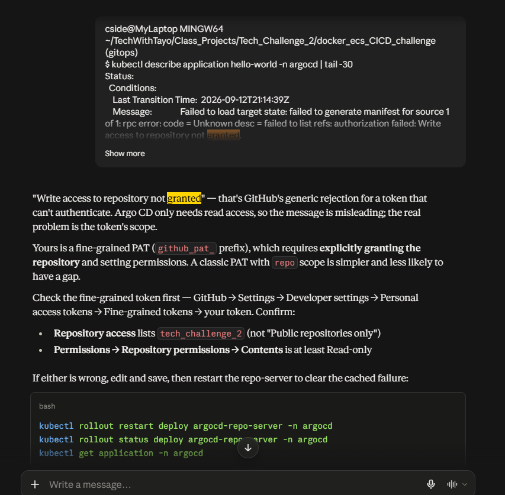

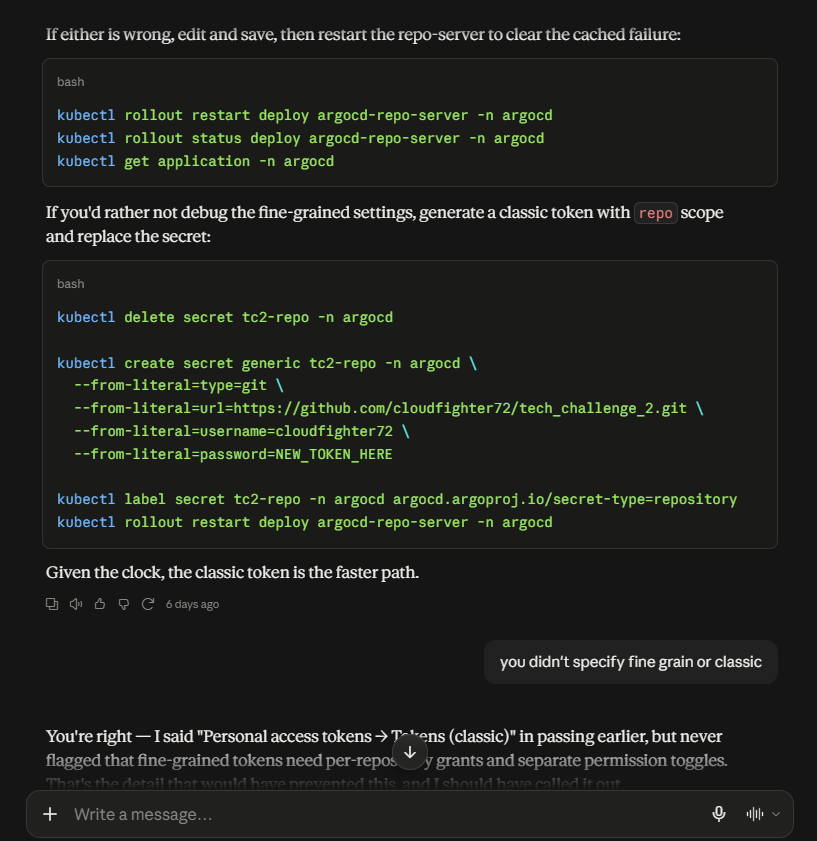

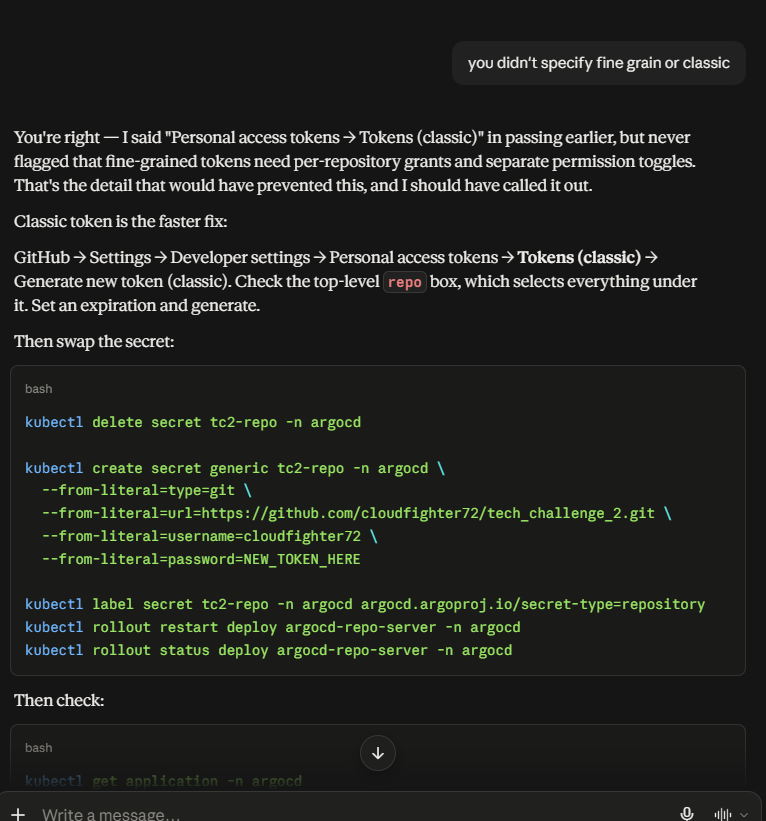

- **Asked:** Why the Argo CD application showed
  `authorization failed` when listing refs from the repo.
- **AI flagged:** My token was a fine-grained PAT, which needs the
  repository explicitly granted and Contents read permission. It gave two
  paths: fix the fine-grained token and restart `argocd-repo-server`, or
  generate a classic token with `repo` scope and recreate the `tc2-repo`
  secret.
- **Pushback:** I pointed out that its original setup steps never said
  whether to use a fine-grained or classic token. It agreed that was the
  detail that would have prevented this, and gave step-by-step instructions
  for the classic token.
- **What I did:** TODO
